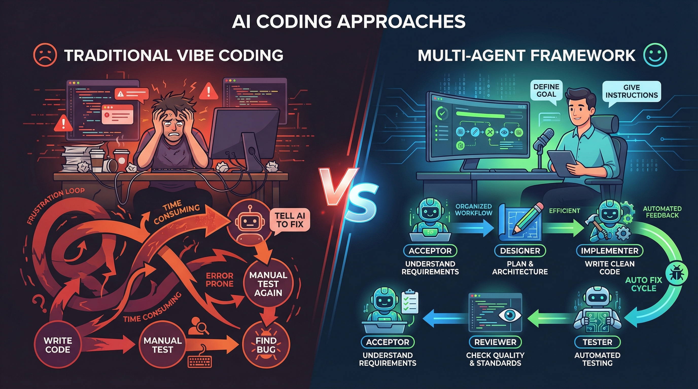

<p align="center">
  
</p>

<h1 align="center">🤖 Multi-Agent Software Development Framework</h1>

<p align="center">
  <a href="https://github.com/cintia09/multi-agent-framework/releases"></a>
  <a href="LICENSE"></a>
  <a href="https://github.com/cintia09/multi-agent-framework/stargazers"></a>
</p>

<p align="center">
  
  
  
  
  
  
</p>

<p align="center">
  <strong>5 个 AI Agent 角色协作的软件开发框架 — 零依赖、FSM 驱动、HITL 审批门禁、DFMEA 风险管理</strong>
</p>

<p align="center">
  <a href="#安装">安装</a> ·
  <a href="#使用方式">使用</a> ·
  <a href="#hitl-审批门禁">HITL 门禁</a> ·
  <a href="#20-个-skills">20 Skills</a> ·
  <a href="#为什么需要这个框架">为什么</a> ·
  <a href="blog/vibe-coding-and-multi-agent.md">博客</a>
</p>

---

零依赖、基于文件的多 Agent 协作框架，适用于 Claude Code 和 GitHub Copilot。

## 概述

5 个专业 AI Agent 角色通过基于文件的状态机协作，覆盖完整的软件开发生命周期 (SDLC)。统一 11 状态 FSM + Human-in-the-Loop 审批门禁 + DFMEA 风险管理。

| 角色 | Emoji | 职责 |
|------|-------|------|
| **验收者** (Acceptor) | 🎯 | 需求收集（用户故事格式）、任务发布、验收测试 |
| **设计者** (Designer) | 🏗️ | 架构设计（ADR 格式）、技术调研、测试规格、Goal 覆盖自查 |
| **实现者** (Implementer) | 💻 | TDD 开发（红绿重构 + 80% 覆盖率）、DFMEA 风险分析、构建修复 |
| **审查者** (Reviewer) | 🔍 | 设计+代码审查、OWASP 安全清单、严重级别评定、置信度过滤 |
| **测试者** (Tester) | 🧪 | 覆盖率分析、Flaky 检测、E2E Playwright、问题报告 |

## 核心特性

- **零依赖** — 纯 Markdown Skills + JSON 状态文件
- **文件持久化** — 所有状态存储在 Git 可追踪的文件中
- **统一 FSM** — 11 状态线性流水线，非法状态转移被拒绝
- **HITL 审批门禁** — 所有 5 个 Agent 阶段产出需人工审批后才能流转
- **DFMEA 风险管理** — 实现者强制输出故障模式分析（S×O×D→RPN 评分）
- **角色隔离** — 每个 Agent 只能在自己的职责范围内操作
- **Hook 强制执行** — Agent 边界由 Shell Hook 强制执行，不靠 LLM 自律
- **角色不匹配检测** — 检测用户请求与当前角色不匹配时提示切换
- **消息收件箱** — Agent 之间通过 `inbox.json` 通信
- **功能目标清单** — 每个任务有可独立验证的功能目标
- **自动调度** — 任务状态变更自动通知下一个 Agent
- **批处理模式** — Agent 在一个循环中处理所有待办任务
- **监控模式** — 测试者↔实现者全自动修复-验证循环
- **问题追踪** — 结构化 JSON + 乐观锁保证并发安全
- **SQLite 审计日志** — 每次工具使用都记录到 events.db
- **任务记忆** — 阶段完成自动保存上下文快照，下个 Agent 按角色智能加载精简记忆
- **超时检测** — 对长时间闲置的任务发出警告
- **流水线可视化** — ASCII 图展示每个任务在 5 阶段流水线中的位置
- **项目级活文档** — 6 个 docs/ 文档由各 Agent 持续更新，反映项目全貌
- **TDD 纪律** — 实现者严格红绿重构 + Git checkpoint + 80% 覆盖率门槛
- **安全审查** — OWASP Top 10 清单 + 4 级严重度 + 置信度过滤
- **覆盖率分析** — 自动检测测试框架、解析覆盖率、识别盲区
- **ADR 格式** — 设计者使用架构决策记录，决策可追溯
- **每 Agent 独立模型** — 可为每个角色配置不同 AI 模型（如 Opus 做设计、Sonnet 做实现）
- **项目类型感知** — 初始化时自动检测项目类型（iOS/前端/后端/系统级/AI-ML），生成针对性 Skills

## 任务生命周期

```
created → designing → implementing → reviewing → testing → accepting → accepted ✅
                         ▲                          ▲  │          │
                         └── reviewing (退回) ───────┘  └── fixing ┘
                                                              ↕
                                                     (测试者↔实现者
                                                      全自动修复-验证循环)

accepting → accept_fail → designing (验收失败，重新设计)
```

任何任务都可以转为 `blocked` 状态（需要人工介入），通过 `unblock` 解除。

## 文档流水线

每个阶段产出标准化文档，作为下一阶段的输入。文档存放在 `.agents/docs/T-XXX/`：

```
Acceptor ──→ requirements.md + acceptance-criteria.md
               ↓
Designer ──→ design.md
               ↓
Implementer → implementation.md
               ↓
Reviewer ──→ review-report.md
               ↓
Tester ────→ test-report.md
               ↓
Acceptor ──→ 基于 acceptance-criteria.md 验收
```

- **⚠️ 文档门禁**: FSM 状态转换时自动检查输出文档是否存在
- **📄 自动提示**: 切换 Agent 时列出当前任务可用的输入文档
- **📋 标准模板**: `agent-docs` skill 提供 6 种文档模板

## HITL 审批门禁

所有 5 个 Agent 的阶段产出必须经过人工审批（Human-in-the-Loop）才能流转到下一阶段：

```
Agent 创建文档 → 发布到交互页面 → 人工审阅评论 → Agent 修改 → 人工点击"Approve" → FSM 状态转移
```

### 4 种平台适配器

| 适配器 | 环境 | 特点 |
|--------|------|------|
| 🌐 `local-html` | 本地开发 | HTTP 服务器 + 暗色主题 Web UI + 多轮反馈 |
| 💻 `terminal` | Docker / SSH / CI | 纯 CLI，零浏览器依赖 |
| 🐙 `github-issue` | GitHub 项目 | 通过 Issue 评论收集反馈 |
| 📝 `confluence` | 企业内网 | Confluence REST API 发布 + 评论轮询 |

- **Docker 自动检测**：检测到容器环境时自动绑定 `0.0.0.0`，跳过浏览器打开
- **多轮反馈**：提交反馈 → Agent 修改文档 → 重新发布 → 再次审阅，循环直到 Approve
- **原子写入**：使用 `os.rename` 保证并发读写安全

### DFMEA 风险管理

实现者在编码前必须输出 DFMEA（Design Failure Mode and Effects Analysis）：

| 字段 | 说明 |
|------|------|
| 失败模式 | 可能出错的地方 |
| 影响 (S) | 严重度 1-10 |
| 原因 (O) | 发生概率 1-10 |
| 检测 (D) | 检测难度 1-10 |
| **RPN** | **S × O × D** — 风险优先数 |
| 缓解措施 | RPN ≥ 100 必须有具体措施 |

FSM Guard 在状态转移时验证：RPN ≥ 100 的项目必须有缓解措施，否则阻止转换。

## 安装

### 方式一：一键安装（脚本自动）

```bash
curl -sL https://raw.githubusercontent.com/cintia09/multi-agent-framework/main/install.sh | bash
```

自动检测 Claude Code / Copilot CLI，下载并安装全部组件。

### 方式二：提示安装（AI 引导）

对你的 AI 助手（Claude Code、GitHub Copilot 等）说：

> "根据 cintia09/multi-agent-framework 仓库里的指引, 将 agents 安装到我本地。"

助手会读取仓库文档并自动执行以下步骤：

1. 克隆仓库到临时目录
2. 复制 20 个 Skill 目录到目标平台 skills 目录
3. 复制 5 个 `.agent.md` 文件到 agents 目录
4. 复制 13 个 Hook 脚本 + `hooks/lib/` 模块 + hooks.json 到 hooks 目录
5. 安装 3 个模块化规则到 rules 目录
6. 追加协作规则到全局指令文件（幂等）
7. 清理临时目录

**目标目录：**

| 平台 | Skills | Agents | Hooks | Rules | 全局指令 |
|------|--------|--------|-------|-------|---------|
| Claude Code | `~/.claude/skills/` | `~/.claude/agents/` | `~/.claude/hooks/` | `~/.claude/rules/` | `~/.claude/CLAUDE.md` |
| Copilot CLI | `~/.copilot/skills/` | `~/.copilot/agents/` | `~/.copilot/hooks/` | — | `~/.copilot/copilot-instructions.md` |

**hooks.json 格式差异**：Claude Code 用 `hooks.json`（PascalCase, `command`, 毫秒），Copilot CLI 用 `hooks-copilot.json`（camelCase, `bash`, 秒）。安装脚本自动选择。

**权限设置**：所有 `.sh` 文件需 `chmod +x`。

### 验证安装

```bash
bash install.sh --check
```

安装完成后，`~/.claude/` 目录结构：
```
~/.claude/
├── CLAUDE.md       # 含 Agent 协作规则
├── rules/                               # 模块化规则（Claude Code 原生）
│   ├── agent-workflow.md                # 角色 + FSM 规则（路径作用域）
│   ├── security.md                      # 安全规则（路径作用域）
│   └── commit-standards.md              # 提交规范
├── hooks/
│   ├── hooks.json                # Hook 配置（9 种事件类型）
│   ├── agent-session-start.sh    # 初始化 events.db，检查待办
│   ├── agent-pre-tool-use.sh     # Agent 边界执行
│   ├── agent-post-tool-use.sh    # 审计日志 + 自动调度
│   ├── agent-staleness-check.sh  # 超时任务检测
│   ├── agent-before-switch.sh    # 切换前验证（可阻止非法切换）
│   ├── agent-after-switch.sh     # 切换后注入角色上下文
│   ├── agent-before-task-create.sh  # 任务创建验证
│   ├── agent-after-task-status.sh   # 状态变更通知 + 记忆沉淀
│   ├── agent-before-memory-write.sh # 写记忆前去重验证
│   ├── agent-after-memory-write.sh  # 写后索引更新
│   ├── agent-before-compaction.sh   # 压缩前自动 flush 记忆
│   ├── agent-on-goal-verified.sh    # 目标验证进度更新
│   └── security-scan.sh          # 🔒 密钥扫描（独立于 Agent 系统）
├── skills/
│   └── agent-*/SKILL.md          # 20 个 Skill 目录（每个含 SKILL.md）
└── agents/
    ├── acceptor.agent.md         # 验收者（原生 Agent Profile）
    ├── designer.agent.md         # 设计者
    ├── implementer.agent.md      # 实现者
    ├── reviewer.agent.md         # 审查者
    └── tester.agent.md           # 测试者
```

**原生集成**：`/agent` 命令可直接列出并切换到这 5 个角色。
**模块化规则**：`~/.claude/rules/` 中的规则支持路径作用域，只在操作匹配文件时加载。
**幂等**：重复安装只覆盖 Skills 和 Agents，不会重复追加规则。

### 平台兼容性

安装脚本自动检测已安装的平台，**同时安装到所有检测到的平台**。

| 功能 | Claude Code | GitHub Copilot CLI |
|------|------------|-------------------|
| Skills | `~/.claude/skills/` ✅ | `~/.copilot/skills/` ✅ |
| Agents | `~/.claude/agents/` ✅ | `~/.copilot/agents/` ✅ |
| Hooks | `~/.claude/hooks/` ✅ | `~/.copilot/hooks/` ✅ |
| hooks.json | PascalCase / `command` / ms | camelCase / `bash` / sec |
| 模块化规则 | `~/.claude/rules/` ✅ | `copilot-instructions.md` ✅ |
| 全局指令 | `CLAUDE.md` | `copilot-instructions.md` |
| MCP | `.mcp.json` ✅ | `mcp-config.json` ✅ |
| Agent 选择 | `/agent` | `/agent` |
| Skills 管理 | 自动加载 | `/skills` |

> 两个平台的 hooks.json 格式不同（事件命名、字段名、超时单位），安装脚本会自动使用对应平台的格式。

## 项目初始化

在任何项目目录中，对 AI 助手说 **"初始化 Agent 系统"**，它会调用 `agent-init` Skill 自动：

1. **收集上下文**（4 个来源）：
   - 检测项目技术栈（语言、框架、测试、CI、部署、Monorepo）
   - 读取 `CLAUDE.md`（项目规范，如果存在）
   - 读取全局 Agent Profiles（`~/.claude/agents/*.agent.md`，角色定义）
   - 读取全局 Skills（`~/.claude/skills/agent-*/SKILL.md`，工作流定义）
2. 创建 `.agents/runtime/` 运行时目录（inbox.json 等）
3. 初始化 `events.db`（SQLite 审计日志）
4. 创建 `.agents/task-board.json` 空任务表
5. **AI 生成 6 个项目级 Skill**（基于上下文定制，非拷贝！）：
   - `project-agents-context` — 项目技术栈、构建命令、部署方式
   - `project-acceptor` — 验收标准、业务背景
   - `project-designer` — 架构约束、技术选型
   - `project-implementer` — 编码规范、开发命令
   - `project-reviewer` — 审查标准、质量要求
   - `project-tester` — 测试框架、覆盖率要求
6. （可选）生成项目级 Hooks（`.agents/hooks/`）
7. 创建 `.agents/.gitignore`（排除运行时状态）

使用内置脚本验证：
```bash
bash /tmp/multi-agent-framework/scripts/verify-init.sh
```

## 使用方式

### 基本命令
```
"初始化 Agent 系统"    → 在当前项目中初始化 .agents/ 目录
/agent                → 浏览并选择角色（原生命令）
/agent acceptor       → 切换到验收者
/agent implementer    → 切换到实现者
"查看 Agent 状态"      → 状态面板（含阻塞任务提醒）
"unblock T-003"       → 解除任务阻塞
```

### 批处理模式
切换到任何 Agent 后说 **"处理任务"** / **"开始工作"**，Agent 自动：
1. 扫描任务表，找出分配给自己的所有待办任务
2. 按优先级排序（high > medium > low）
3. 逐个处理，处理完自动拿下一个
4. 全部完成后输出处理摘要

### 监控模式（测试者 ↔ 实现者）

**测试者**：
```
"监控实现者的修复"     → 自动验证 fixed issues，全部通过则转 accepting
```

**实现者**：
```
"监控测试者的反馈"     → 自动修复 open/reopened issues，等待验证
```

两边全自动循环 — 无需手动 check。通过自动调度 + 收件箱实现自动重入。

## 20 个 Skills

| # | Skill | 描述 |
|---|-------|------|
| 1 | `agent-fsm` | FSM 引擎 — 统一 11 状态 + Guard 规则 + DFMEA 验证 + hypothesizing 状态 |
| 2 | `agent-task-board` | 任务 CRUD + 功能目标 + 阻塞/解阻塞 + 乐观锁 |
| 3 | `agent-messaging` | Agent 间收件箱消息 + 结构化类型 + 回放 + 优先级 + 线程/回复 + 广播 |
| 4 | `agent-init` | 项目初始化 + 技术栈检测 + HITL 平台选择 + ask-next-step 规则注入 |
| 5 | `agent-switch` | 角色切换 + 状态面板 + FSM 自动转移 + 角色不匹配检测 + Cron + Webhook |
| 6 | `agent-memory` | 三层记忆（长期/日记/项目）+ FTS5 索引 + 混合检索 + 自动晋升 + Context Engine |
| 7 | `agent-acceptor` | 验收者工作流 + 用户故事格式 + Worktree 提示 + HITL 门禁 + 活文档维护 |
| 8 | `agent-designer` | 设计者工作流 + ADR 格式 + Goal 覆盖自查 + HITL 门禁 + 活文档维护 |
| 9 | `agent-implementer` | TDD 纪律 + DFMEA 强制输出 + 构建修复 + HITL 门禁 + 监控模式 + 活文档维护 |
| 10 | `agent-reviewer` | 设计+代码审查 + OWASP 安全 + 严重级别 + HITL 门禁 + 活文档维护 |
| 11 | `agent-tester` | 覆盖率分析 + Flaky 检测 + E2E Playwright + HITL 门禁 + 活文档维护 |
| 12 | `agent-events` | events.db 查询、分析、清理、导出 |
| 13 | `agent-hooks` | 13 Hook 生命周期管理 + Block/Approval 语义 + 优先级链 + 工具 Profile |
| 14 | `agent-teams` | Agent Teams 并行执行 — Subagent 派生 + tmux 分屏 + 团队仪表盘 + 竞争假设 |
| 15 | `agent-orchestrator` | 统一 FSM 编排 — 自动驱动 + prompt 模板 + 可插拔 CI/Review/Device |
| 16 | `agent-config` | Agent 配置工具 — model/tools 管理，动态发现，多平台同步 |
| 17 | `agent-docs` | 文档流水线 — 阶段性文档模板 + 输入/输出门禁 + 自动加载 |
| 18 | `agent-hypothesis` | 竞争假设探索 — Fork/Evaluate/Promote + 并行方案对比 + 评分矩阵 |
| 19 | `agent-worktree` | Git Worktree 并行任务管理 — 独立分支/目录 + 合并 + 清理 |
| 20 | `agent-hitl-gate` | **NEW** HITL 审批门禁 — 4 平台适配器 + 多轮反馈 + Docker 支持 |

## 问题追踪（测试者 ↔ 实现者）

结构化 JSON（`T-NNN-issues.json`）是唯一真相源。Issue 状态流转：`open → fixed → verified ✅`（或 `→ reopened → fixed → ...`）。

- **字段归属**：测试者写问题详情和状态（open/verified），实现者写 fix_note 和 fix_commit
- **并发安全**：乐观锁（version 字段）+ 字段隔离防止冲突
- **Markdown 报告**：从 JSON 自动生成（只读）

> 📖 详细格式示例见 [USAGE_GUIDE](docs/USAGE_GUIDE.md)

## 任务记忆

每个任务有独立的记忆文件（`.agents/memory/T-NNN-memory.json`），跨阶段积累上下文：

- **自动保存** — 状态转移时自动保存工作摘要、关键决策、产出物
- **智能加载** — 下一个 Agent 按角色只加载需要的字段
- **搜索记忆** — 跨所有任务搜索决策、踩坑记录、交接备注
- **项目摘要** — 汇总所有任务的架构决策和高风险文件

> 📖 详细格式和搜索功能见 [USAGE_GUIDE](docs/USAGE_GUIDE.md)

## 功能目标清单

每个任务包含功能目标清单（goals）：
- **验收者** 创建任务时定义 goals（每个 goal 是一个可独立验证的功能点）
- **实现者** 逐个实现 goals，标记为 `done`，全部 done 才能提交审查
- **验收者** 验收时逐个验证 goals，标记为 `verified`，全部 verified 才能通过验收

## Hooks（13 个脚本 / 9 种事件）

### v1.0 核心 Hooks

| Hook | 文件 | 触发事件 | 功能 |
|------|------|---------|------|
| **security-scan** | `security-scan.sh` | PreToolUse | 🔒 提交前扫描 staged 文件中的密钥（独立于 Agent 系统，始终运行） |
| **session-start** | `agent-session-start.sh` | SessionStart | 初始化 events.db，检查待办消息/任务 |
| **pre-tool-use** | `agent-pre-tool-use.sh` | PreToolUse | 强制执行 Agent 边界 — 拒绝越权操作 |
| **post-tool-use** | `agent-post-tool-use.sh` | PostToolUse | 审计日志 + 自动调度到下一个 Agent |
| **staleness-check** | `agent-staleness-check.sh` | PostToolUse | 检测闲置超过 24 小时的任务，发出警告 |

### v2.0 生命周期 Hooks

| Hook | 文件 | 触发事件 | 功能 |
|------|------|---------|------|
| **before-switch** | `agent-before-switch.sh` | AgentSwitch | 切换前验证 — 可阻止非法切换 |
| **after-switch** | `agent-after-switch.sh` | AgentSwitch | 切换后注入角色上下文 |
| **before-task-create** | `agent-before-task-create.sh` | TaskCreate | 任务创建验证（格式、重复检测） |
| **after-task-status** | `agent-after-task-status.sh` | TaskStatusChange | 状态变更后通知 + 记忆沉淀 |
| **before-memory-write** | `agent-before-memory-write.sh` | MemoryWrite | 写记忆前去重验证 |
| **after-memory-write** | `agent-after-memory-write.sh` | MemoryWrite | 写后触发 FTS5 索引更新 |
| **before-compaction** | `agent-before-compaction.sh` | Compaction | 压缩前自动 flush 记忆到文件 |
| **on-goal-verified** | `agent-on-goal-verified.sh` | GoalVerified | 目标验证时更新进度 |

### Agent 边界规则（pre-tool-use）

| 角色 | 可编辑 | 不可编辑 |
|------|--------|---------|
| 🎯 验收者 | `.agents/` 目录 | 源代码 ⛔ |
| 🏗️ 设计者 | `.agents/` 目录 | 源代码 ⛔ |
| 💻 实现者 | 源代码 + 自己的工作区 | 其他 Agent 的工作区 ⛔ |
| 🔍 审查者 | 审查报告 + 任务看板 | 源代码 ⛔ |
| 🧪 测试者 | 测试文件 + 自己的工作区 | 源代码 ⛔ |

### 自动调度（post-tool-use）

当 `task-board.json` 被写入时，Hook 自动：
1. 检测新的任务状态
2. 映射到负责的 Agent
3. 写入该 Agent 的收件箱
4. 记录 `auto_dispatch` 事件到 events.db

## 审计日志（events.db）

所有 Agent 操作记录到 `.agents/events.db`（SQLite）：

| 字段 | 类型 | 描述 |
|------|------|------|
| timestamp | INTEGER | Unix 时间戳（毫秒） |
| event_type | TEXT | session_start、tool_use、task_board_write、auto_dispatch |
| agent | TEXT | 当前活跃 Agent |
| task_id | TEXT | 关联任务 ID |
| tool_name | TEXT | 使用的工具 |
| detail | TEXT | JSON 详情字符串 |

通过 `agent-events` Skill 或直接查询：
```bash
sqlite3 .agents/events.db "SELECT * FROM events ORDER BY id DESC LIMIT 20;"
```

## 文件结构

```
~/.claude/                            # 全局层（安装后）
├── rules/                             # 模块化规则（路径作用域）
│   ├── agent-workflow.md              # 角色 + FSM 规则
│   ├── security.md                    # 安全规则
│   └── commit-standards.md            # 提交规范
├── hooks/
│   ├── hooks.json                     # Hook 配置（9 种事件类型）
│   ├── agent-session-start.sh         # 初始化 events.db
│   ├── agent-pre-tool-use.sh          # 边界执行
│   ├── agent-post-tool-use.sh         # 审计日志 + 自动调度
│   ├── agent-staleness-check.sh       # 超时检测
│   ├── agent-before-switch.sh         # 切换前验证
│   ├── agent-after-switch.sh          # 切换后上下文注入
│   ├── agent-before-task-create.sh    # 任务创建验证
│   ├── agent-after-task-status.sh     # 状态变更处理
│   ├── agent-before-memory-write.sh   # 记忆写入验证
│   ├── agent-after-memory-write.sh    # 索引更新
│   ├── agent-before-compaction.sh     # 压缩前 flush
│   ├── agent-on-goal-verified.sh      # 目标验证
│   └── security-scan.sh              # 🔒 密钥扫描
├── skills/
│   └── agent-*/SKILL.md               # 20 个 Skill 目录
└── agents/
    └── *.agent.md                     # 5 个角色 Profile

<项目>/.agents/                        # 项目层（初始化后）
├── events.db                          # SQLite 审计日志
├── skills/project-*/SKILL.md          # 6 个 AI 生成的项目级 Skill
├── task-board.json / .md              # 任务表
├── tasks/T-NNN.json                   # 任务详情 + 功能目标
├── memory/T-NNN-memory.json           # 任务记忆（跨阶段上下文快照）
├── orchestrator/                      # 统一 FSM 编排器
│   ├── run.sh                         # 编排器脚本
│   ├── daemon.pid                     # PID 文件
│   └── logs/                          # 运行日志
├── prompts/                           # prompt 模板
└── runtime/
    ├── active-agent                   # 当前活跃 Agent
    └── <角色>/
        ├── inbox.json
        └── workspace/                 # 工作产出物
            └── issues/T-NNN-issues.json  # 结构化问题追踪

<项目>/docs/                            # 项目级活文档（各 Agent 持续更新）
├── requirement.md                     # 🎯 验收者维护：需求汇总
├── design.md                          # 🏗️ 设计者维护：架构方案 + ADR
├── test-spec.md                       # 🧪 测试者维护：测试策略 + 用例
├── implementation.md                  # 💻 实现者维护：实现细节 + 变更
├── review.md                          # 🔍 审查者维护：审查结论 + 质量
└── acceptance.md                      # 🎯 验收者维护：验收结果 + 里程碑
```

## 设计灵感

| 项目 | Stars | 采纳的关键思想 |
|------|-------|-------------|
| [MetaGPT](https://github.com/geekan/MetaGPT) | 66K | `Code = SOP(Team)` — 将标准流程嵌入 Agent |
| [NTCoding/autonomous-claude-agent-team](https://github.com/NTCoding/autonomous-claude-agent-team) | 36 | Hook 强制执行、RESPAWN 模式、事件溯源 |
| [dragonghy/agents](https://github.com/dragonghy/agents) | — | YAML 配置、MCP 通信、超时检测 |
| [TaskGuild](https://github.com/kazz187/taskguild) | 3 | 状态驱动 Agent 触发、看板自动化 |

## 路线图

- **Phase 1** ✅ 手动角色切换 + FSM + 任务看板 + 功能目标
- **Phase 2** ✅ Hooks（边界执行）+ events.db（审计日志）
- **Phase 3** ✅ 自动调度 + 超时检测 + 批处理模式 + 监控模式
- **Phase 4** ✅ 记忆系统（自动沉淀 + 智能加载）+ 流水线可视化 + 项目级活文档
- **Phase 5** ✅ ECC 最佳实践融合（TDD 纪律 + 安全审查 + 覆盖率分析 + ADR）
- **Phase 6** ✅ 结构化消息 + Cycle Time 度量 + 看板增强 + 项目级记忆
- **Phase 7** ✅ 基础设施（一键安装 + 版本管理 + 社区模板 + 测试套件）
- **Phase 8** ✅ 记忆系统 2.0（三层架构 + FTS5 索引 + 混合检索 + 自动晋升）
- **Phase 9** ✅ Hook 精细化（13 hook 脚本 / 9 事件类型 + 终止/审批语义 + 工具 Profile）
- **Phase 10** ✅ 调度自动化（Cron + Webhook + FSM 自动推进）
- **Phase 11** ✅ Context Engine（预算管理 + 角色注入 + 智能压缩）
- **Phase 12** ✅ Agent Teams 集成（Subagent 派生 + 并行实现/审查）
- **Phase 13** ✅ 3-Phase 工程闭环（双模式 FSM + 编排器 + 并行轨道 + 反馈环 + 可插拔 CI/Review/Device）
- **Phase 14** ✅ Agent 体验增强（统一 FSM + HITL 审批门禁 + DFMEA + 角色不匹配检测 + Worktree 提示）

---

## 为什么需要这个框架？

<details>
<summary>💡 点击展开：从 Vibe Coding 到 Agent 团队协作</summary>

### 从编译器到 Agent：不变的本质

Vibe Coding 其实就是自然语言编程。

传统编程中，我们使用专用语言 —— Java、C++、Python —— 来描述功能，然后通过编译器将其转换为 CPU 可执行的代码。

Vibe Coding 也是同一件事：用自然语言描述功能，由 AI Agent 将其转换为 CPU 可执行的代码。

**不变的是**：不管你用自然语言还是 Java，它们都只是描述"我需要实现什么功能"的工具。

**变的是**：因为 Agent 足够智能，自然语言描述不必像传统语言那样精确，你也不必学习那些晦涩难懂的编程知识。这极大地拉低了编程的门槛。

但 —— **软件工程的本质没有变化**。如果你想构建一个足够好的应用，你仍然需要理解需求分析、架构设计、代码审查、测试验证这些环节。

### 一段痛苦的 Vibe Coding 经历

这个结论来自真实的痛苦经历：

```
我: "帮我实现用户登录功能"
Agent: (一通操作，代码写好了)
我: (手动测试)...不行，登录后页面空白
我: "登录后页面空白，帮我修"
Agent: (又一通操作)
我: (手动测试)...这次登录行了，但注册不行了
我: "注册怎么又坏了？"
...重复 N 次...
```

你要一直坐在电脑前，不停地和 Agent 交流、打字、手动验证、反复返工。**很痛苦。**

问题不是 Agent 不够聪明，而是整个过程缺乏**流程**：没有设计、没有自动化测试、没有代码审查、没有结构化的问题追踪。



这些不就是传统软件工程早已解决的问题吗？

### 解决方案：Agent 团队协作

于是我做了这个框架。核心理念 —— 既然 Vibe Coding 是"自然语言编程"，那整个软件开发流程也应该能用自然语言来定义和执行。


**全程你只需要做两件事：创建任务 + 最终验收。** 中间的设计、实现、审查、测试、修复，全部由 Agent 自动完成。

### 好处

1. **不再人肉验证循环** — 测试者 Agent 自动运行测试、报告 Bug、验证修复
2. **质量由流程保证** — 不取决于"Agent 今天状态好不好"
3. **Bug 修复有追踪** — 结构化 JSON 记录，不在聊天记录里翻找
4. **流程不可绕过** — Shell Hook 强制执行规则，不靠 AI 的"自觉"
5. **随时可接手** — 所有状态在文件里，CLI 崩溃也能继续

> 这可能就是 Vibe Coding 的最终形态 —— 不是一个人和一个 Agent 反复拉扯，而是一个 **Agent 团队**各司其职，像真正的软件开发团队一样协作。而有意思的是，连这个框架本身，也是由 Agent 写的。

</details>

## Agent Teams（代理团队）

### 核心架构

```
Team Lead (Acceptor)
├── Designer    ←→ 双向消息 + 线程回复
├── Implementer ←→ 广播接收 + 假设探索
├── Reviewer    ←→ 收件箱优先级 + 评估评分
└── Tester      ←→ 竞争假设 + 团队仪表盘
    │
    └── 📊 Team Dashboard (tmux 底栏)
```

### 三大特性

**1. 双向消息通信** — Agent 间可直接对话，不仅仅是单向派发
- 线程会话：`reply_to` + `thread_id` 支持消息链
- 广播消息：`type: broadcast` 通知全团队
- 优先级队列：🔴 urgent 置顶，切换 Agent 时自动显示未读数

**2. tmux 分屏并行** — 多 Agent 同时工作
```bash
# 启动全团队
bash scripts/team-session.sh

# 指定 Agent + 任务
bash scripts/team-session.sh --agents implementer,tester,reviewer --task T-042
```
底部仪表盘实时显示：Agent 状态、收件箱计数、流水线进度条、最近事件。

**3. 竞争假设探索** — 面对多方案抉择时并行探索
```
designing → hypothesizing → evaluate → promote winner → designing
```
每个假设独立工作区（`.agents/hypotheses/T-XXX/H-N/`），按权重评分矩阵择优。

### 使用场景
| 场景 | 推荐模式 |
|------|---------|
| 并行 Code Review | tmux 分屏 + reviewer 多实例 |
| 多模块同时开发 | tmux 分屏 + implementer + tester |
| 架构方案选型 | 竞争假设 (2-4 个方案) |
| 多疑点并行调试 | 竞争假设 + 子 Agent 派生 |

## 已知限制 & 常见问题

### 已知限制

| 限制 | 说明 | 解决方案 |
|------|------|----------|
| **仅 CLI** | 框架通过 Shell Hook 运行，需要 Claude Code 或 Copilot CLI | 不支持 Web UI / API 模式 |
| **macOS/Linux** | 依赖 bash 4+、jq、sqlite3 | Windows 需使用 WSL |
| **单项目** | `.agents/` 目录绑定单个项目 | 多项目需分别初始化 |
| **文档门禁** | 默认 warn 模式仅警告；strict 模式可阻止转换 | 在 `task-board.json` 设置 `"doc_gate_mode": "strict"` |
| **内存索引** | 需要项目自行提供 `memory-index.sh` | 可选功能，不影响核心流程 |

### 常见问题

**Q: hooks 报错 `jq: command not found`**
→ 安装 jq：`brew install jq`（macOS）或 `apt install jq`（Linux）

**Q: `events.db` 报 "database is locked"**
→ 框架使用 `mkdir` 原子锁替代 `flock`，正常情况不会锁死。若出现，删除 `.agents/runtime/.lock` 目录。

**Q: Agent 切换后没有收到前一阶段的文档提示**
→ 确保 `.agents/docs/T-XXX/` 下有对应文档，`after-switch` hook 会自动列出。

**Q: FSM 报 ILLEGAL transition 但我确定是对的**
→ 检查 `task-board.json` 中的任务状态。v3.4.0 使用统一 11 状态 FSM，旧的 3-Phase 状态会自动映射。参考 `agent-fsm` skill。

**Q: `install.sh` 安装后 hook 不生效**
→ 确认 `~/.claude/hooks.json` 或 `~/.copilot/hooks.json` 存在且指向正确路径。运行 `bash install.sh` 会自动修复。

## 许可证

MIT
