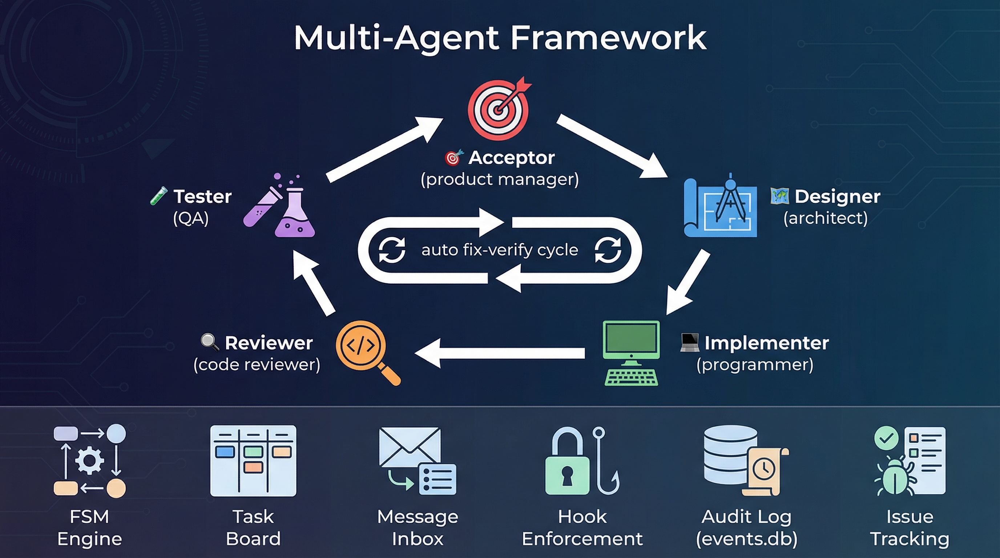

<p align="center">
  
</p>

<h1 align="center">🤖 CodeNook — Multi-Agent Development Framework</h1>

<p align="center">
  <a href="https://github.com/cintia09/CodeNook/releases"></a>
  <a href="LICENSE"></a>
  <a href="https://github.com/cintia09/CodeNook/stargazers"></a>
</p>

<p align="center">
  
  
  
  
</p>

<p align="center">
  <strong>5 AI agents, 1 skill, document-driven workflow — zero dependencies, 10 HITL approval gates, DFMEA risk management</strong>
</p>

<p align="center">
  🧪 <strong>v5.0 POC available</strong> — clean-slate workspace-OS redesign in <a href="skills/codenook-v5-poc/README.md"><code>skills/codenook-v5-poc/</code></a> (router-only main session, Mode B sub-agents, OS-keyring credentials, mandatory startup security audit). Not part of the v4.9.5 stable installer.
</p>

<p align="center">
  <a href="#installation">Installation</a> ·
  <a href="#quick-start">Quick Start</a> ·
  <a href="#architecture">Architecture</a> ·
  <a href="#hitl-multi-adapter-system">HITL</a> ·
  <a href="#agent-profiles">Agent Profiles</a> ·
  <a href="blog/vibe-coding-and-multi-agent.md">Blog</a> ·
  <a href="https://github.com/cintia09/CodeNook/releases">Changelog</a>
</p>

---

Zero-dependency, orchestrator-driven multi-agent framework for Claude Code and Copilot CLI.

## Overview

Five specialized AI agents collaborate through an orchestrator that routes tasks, spawns subagents, and enforces human-in-the-loop gates between every phase.

| Role | Emoji | Responsibilities | Tools | Model (default) |
|------|-------|------------------|-------|-----------------|
| **Acceptor** | 🎯 | Requirements gathering, goal decomposition, acceptance testing | Read, Bash, Grep, Glob | claude-opus-4.6 |
| **Designer** | 🏗️ | Architecture design (ADR format), API specs, test specifications | Read, Bash, Grep, Glob, WebFetch | claude-opus-4.6 |
| **Implementer** | 💻 | TDD development (red-green-refactor), DFMEA risk analysis | Read, Edit, Create, Bash, Grep, Glob | claude-opus-4.6 |
| **Reviewer** | 🔍 | Code review, OWASP security checklist, severity rating | Read, Bash, Grep, Glob | gpt-5.4 |
| **Tester** | 🧪 | Test execution, coverage analysis, issue reporting | Read, Bash, Grep, Glob, Edit, Create | claude-opus-4.6 |

## Core Features

- **Document-Driven Workflow** — Every agent produces a planning document before executing: Plan → Approve → Act → Report → Approve
- **1 Skill** — `codenook-init` installs agent system + deploys orchestration engine per-project
- **Subagent Architecture** — Each agent runs in a separate context window, spawned on demand
- **10 HITL Gates** — Every phase has a HITL gate; 10-row status routing table with deterministic routing
- **10 Document Artifacts** — Each task produces requirement, design, implementation, DFMEA, review, test, and acceptance docs stored to `codenook/docs/T-NNN/`
- **Task Board** — Single JSON file as source of truth; 10 statuses with deterministic routing
- **Multi-Task Management** — Independent task progress with switch, pause/resume, and task dependencies
- **Any-Phase Entry** — Start tasks from any phase with `--start-at`; jump between phases via conversation
- **Smart Skill Provisioning** — Auto-scan global skills, classify into categories, map to agent roles
- **Per-Phase Configuration** — Models and HITL adapters configurable per-phase (not just per-agent)
- **Conversation-Driven** — Natural language triggers for all operations (no CLI commands needed)
- **Verdict-Based Routing** — Review/test/acceptance report verdicts drive the next status transition
- **Mermaid Diagrams** — Mandatory in all document outputs for visual clarity
- **Memory Chain** — Each phase writes a snapshot; downstream agents receive upstream context
- **Knowledge Accumulation** — Agents automatically extract cross-task lessons (code conventions, pitfalls, architecture decisions) indexed by role and topic; accumulated knowledge injected into future agent prompts
- **DFMEA Risk Management** — Implementer outputs failure-mode analysis (S×O×D → RPN)
- **Dual-Agent Mode** — Two models work sequentially with iterative cross-examination (up to 3 convergence rounds), blind challenge protocol, and per-phase user confirmation
- **Build Verification** — Implementer runs production build + unit tests before HITL gate; failures auto-retry with feedback
- **3-Stage Code Review** — Local code-review agent → Remote formal review (Gerrit/GitHub) → CI pipeline verification
- **Module + System Testing** — Tester designs module integration tests and system tests for real device/hardware execution
- **Phase Constitution** — Per-phase quality criteria (Constitutional AI-inspired) for focused cross-examination evaluation
- **Tool-Based Boundaries** — `tools` / `disallowedTools` in agent frontmatter (no hooks needed)
- **Zero Dependencies** — Pure Markdown profiles + JSON state files
- **Claude Code + Copilot CLI** — Primary: `.claude/`, also supports `~/.copilot/skills/`

## Installation

### Option 1: One-Line Install

```bash
curl -sL https://raw.githubusercontent.com/cintia09/CodeNook/main/install.sh | bash
```

Installs 1 skill globally for Claude Code and/or Copilot CLI (auto-detected).

### Option 2: Manual Install

Copy the skill directory to your platform's skills folder:

| Platform | Target |
|----------|--------|
| Claude Code | `~/.claude/skills/codenook-init/` |
| Copilot CLI | `~/.copilot/skills/codenook-init/` |

The skill directory contains `SKILL.md`, agent templates, HITL adapter scripts, and the orchestration engine template.

### Verify

```bash
ls ~/.claude/skills/codenook-init/SKILL.md 2>/dev/null && echo "✅ Installed" || echo "❌ Not found"
# Or for Copilot CLI:
ls ~/.copilot/skills/codenook-init/SKILL.md 2>/dev/null && echo "✅ Installed" || echo "❌ Not found"
```

## Quick Start

### 1. Initialize the Agent System

In any project directory, tell your AI assistant:

> "Initialize the agent system"

The `codenook-init` skill walks you through prompts:

| Prompt | Options |
|--------|---------|
| Install directory | Confirm or change target directory |
| Platform | Claude Code · Copilot CLI |
| Agent models | Use defaults · Custom per-agent · **Custom per-phase** |
| HITL adapter | Local HTML · Terminal · GitHub Issue · Confluence · **Per-phase** |
| Gitignore | Yes · No |
| **Skill provisioning** | **Scan & assign · Skip** |

It then generates project-level files:

```
<root>/                          # .claude/
├── agents/
│   ├── acceptor.agent.md
│   ├── designer.agent.md
│   ├── implementer.agent.md
│   ├── reviewer.agent.md
│   └── tester.agent.md
├── codenook/
│   ├── docs/                    # Document artifacts per task
│   │   └── T-NNN/               # 10 docs per task lifecycle
│   ├── memory/
│   ├── knowledge/               # Cross-task knowledge base (by-role + by-topic)
│   ├── reviews/                 # Review reports and verdicts
│   ├── skills/                  # Project-level skills (auto-provisioned)
│   ├── task-board.json
│   ├── config.json
│   └── hitl-adapters/           # HITL scripts (auto-copied)
│       ├── terminal.sh
│       ├── local-html.sh
│       ├── github-issue.sh
│       ├── confluence.sh
│       ├── hitl-verify.sh
│       └── hitl-server.py
```

> The orchestration engine is appended to the project-root `CLAUDE.md`.

### 2. Create a Task

```
"Create task: Implement user authentication"
"Create task: Fix login --start-at impl_plan"     # Start from implementation
"Create task: Auth API --depends T-001"            # With dependency
"Quick fix: typo in README"                        # Lightweight 2-phase
```

### 3. Run the Task

> "Run task T-001"

The orchestrator drives the task through the pipeline:

```
created → acceptor(req) → [HITL] → req_approved
       → designer → [HITL] → design_approved
       → implementer(plan) → [HITL] → impl_planned
       → implementer(execute) → [HITL] → impl_done
       → reviewer(plan) → [HITL] → review_planned
       → reviewer(execute) → [HITL] → review_done
       → tester(plan) → [HITL] → test_planned
       → tester(execute) → [HITL] → test_done
       → acceptor(accept-plan) → [HITL] → accept_planned
       → acceptor(accept-exec) → [HITL] → done
```

### 4. Multi-Task Workflow

```
"Switch T-002"                    # Focus on task T-002
"Pause T-001"                     # Pause current work
"Resume T-001"                    # Continue paused task
"Jump to test"                    # Skip to test phase (with confirmation)
"Task board"                      # Show all tasks with status
```

You approve or provide feedback at each of the 10 HITL gates. That's it.

## Architecture

```
                         ┌───────────────────┐
                         │    USER  (You)     │
                         │  "create task"     │
                         │  "run task T-001"  │
                         └────────┬──────────┘
                                  │
                                  ▼
┌────────────────────────────────────────────────────────────────┐
│                  ORCHESTRATOR  (main session)                   │
│                                                                │
│  ┌──────────────┐  ┌────────────┐  ┌──────────┐  ┌──────────┐ │
│  │ task-board    │  │ config     │  │ memory/  │  │knowledge/│ │
│  │  .json        │  │  .json     │  │ (phase   │  │ by-role/ │ │
│  │ (task state   │  │ (models,   │  │ snap-    │  │ by-topic/│ │
│  │  & artifacts) │  │  hitl,     │  │ shots)   │  │ index.md │ │
│  │               │  │  dual_mode,│  │          │  │          │ │
│  │               │  │  knowledge)│  │          │  │          │ │
│  └──────────────┘  └────────────┘  └──────────┘  └──────────┘ │
│                                                                │
│  ┌────────────────────── Phase Flow ────────────────────────┐  │
│  │                                                          │  │
│  │   ① Route by status ──→ ② Spawn subagent(s)             │  │
│  │           │                    │                          │  │
│  │           │              ┌─────┴─────┐                   │  │
│  │           │         Single mode  Dual-Agent mode         │  │
│  │           │              │      ┌────┴─────┐             │  │
│  │           │              │   Agent A    Agent B           │  │
│  │           │              │      │     ╳     │             │  │
│  │           │              │      └──┬──┘  ┌──┘             │  │
│  │           │              │  analyze divergence            │  │
│  │           │              │  (Phase Constitution)          │  │
│  │           │              │  → blind challenges ≤3 rounds  │  │
│  │           │              │  → synthesize final doc        │  │
│  │           │              └────────┬──────┘                │  │
│  │           │                       │                       │  │
│  │           │              ③ Save document to disk          │  │
│  │           │                       │                       │  │
│  │           │   ┌───────────────────┴──────────────────┐   │  │
│  │           │   │  ④ HITL Gate (adapter.<phase>)        │   │  │
│  │           │   │  local-html │ terminal │ github-issue │   │  │
│  │           │   │  confluence │ per-phase overrides     │   │  │
│  │           │   │  ── approve / request changes ──      │   │  │
│  │           │   └───────────────────┬──────────────────┘   │  │
│  │           │                       │                       │  │
│  │           │              ⑤ Advance status / retry         │  │
│  │           │              ⑥ Extract knowledge              │  │
│  │           │                       │                       │  │
│  │           └──── loop (×10 phases per full cycle) ────────┘  │
│  └──────────────────────────────────────────────────────────┘  │
│                                                                │
│  docs/T-NNN/   requirement-doc → design-doc → implementation   │
│                → dfmea → review-prep → review-report           │
│                → test-plan → test-report → acceptance-plan/rpt │
└──┬──────────┬──────────┬──────────┬──────────┬────────────────┘
   │          │          │          │          │
   ▼          ▼          ▼          ▼          ▼
┌────────┐┌────────┐┌────────┐┌────────┐┌────────┐
│🏗️ Des- ││💻 Impl-││🔍 Rev- ││🧪 Test-││🎯 Acce-│
│igner   ││ementer ││iewer   ││er      ││ptor    │
│        ││        ││        ││        ││        │
│opus 4.6││opus 4.6││gpt-5.4 ││opus 4.6││opus 4.6│
│plan+exe││plan+exe││plan+exe││plan+exe││req+acc │
└────────┘└────────┘└────────┘└────────┘└────────┘
    Separate context windows — spawned on demand
```

**Key principle:** The orchestrator is the sole writer of `codenook/task-board.json`. Every agent produces a document before executing — Plan → Approve → Act → Report → Approve. Documents are stored to `codenook/docs/T-NNN/` with Mermaid diagrams mandatory in all outputs.

**Dual-Agent Mode:** When enabled for a phase, the user is asked to confirm before each dual-agent execution. Two models then produce documents sequentially (Agent A first, then Agent B), the orchestrator analyzes divergence using Phase Constitution criteria, challenges each agent on its weaknesses (blind — neither sees the other's work), and synthesizes the final output. Up to 3 convergence rounds before synthesis.

## Task Lifecycle

### Status Routing Table

| # | Status | Handler | On Approve | On Reject |
|---|--------|---------|------------|-----------|
| 1 | `created` | → Acceptor (req) | `req_approved` | `created` *(self-retry)* |
| 2 | `req_approved` | → **[HITL]** → Designer | `design_approved` | `req_approved` *(self-retry)* |
| 3 | `design_approved` | → **[HITL]** → Implementer (plan) | `impl_planned` | `design_approved` *(self-retry)* |
| 4 | `impl_planned` | → **[HITL]** → Implementer (execute) | `impl_done` | `impl_planned` *(self-retry)* |
| 5 | `impl_done` | → **[HITL]** → Reviewer (plan) | `review_planned` | `impl_done` *(self-retry)* |
| 6 | `review_planned` | → **[HITL]** → Reviewer (execute) | `review_done` | `impl_planned` *(rollback to impl)* |
| 7 | `review_done` | → **[HITL]** → Tester (plan) | `test_planned` | `review_done` *(self-retry)* |
| 8 | `test_planned` | → **[HITL]** → Tester (execute) | `test_done` | `impl_planned` *(rollback to impl)* |
| 9 | `test_done` | → **[HITL]** → Acceptor (accept-plan) | `accept_planned` | `test_done` *(self-retry)* |
| 10 | `accept_planned` | → **[HITL]** → Acceptor (accept-exec) | `done` | `design_approved` *(rollback to design)* |

- **10 HITL gates** — every phase has a HITL gate; no auto-advancement
- **Verdict-based routing** — plan phases self-retry on reject; execute phases roll back to the relevant plan phase
- Subagent errors pause the loop and report to the user
- See [PIPELINE.md](PIPELINE.md) for the full phase-by-phase workflow reference

### Task Board Schema

```json
{
  "version": "4.9.5",
  "active_task": null,
  "tasks": [{
    "id": "T-001",
    "title": "Implement user authentication",
    "status": "created",
    "priority": "P0",
    "goals": [
      { "id": "G1", "description": "JWT login endpoint", "status": "pending" }
    ],
    "mode": "full",
    "pipeline": null,
    "start_at": null,
    "depends_on": [],
    "model_override": null,
    "dual_mode": null,
    "artifacts": {
      "requirement_doc": null,
      "design_doc": null,
      "implementation_doc": null,
      "dfmea_doc": null,
      "review_prep": null,
      "review_report": null,
      "test_plan": null,
      "test_report": null,
      "acceptance_plan": null,
      "acceptance_report": null
    },
    "retry_counts": {},
    "total_iterations": 0,
    "phase_decisions": {},
    "paused_from": null,
    "feedback_history": [],
    "created_at": "2025-01-15T10:00:00Z",
    "updated_at": "2025-01-15T10:00:00Z"
  }]
}
```

Documents are stored to disk at `codenook/docs/T-NNN/` with filenames matching the artifact keys (e.g., `requirement-doc.md`, `design-doc.md`, `implementation-doc.md`, `dfmea-doc.md`, `review-prep.md`, `review-report.md`, `test-plan.md`, `test-report.md`, `acceptance-plan.md`, `acceptance-report.md`).

### Commands

| Command | Action |
|---------|--------|
| `create task <title>` | Add task with status `created` |
| `show task board` | Display all tasks with status |
| `run task T-XXX` | Start orchestration loop |
| `task status T-XXX` | Show detailed status + history |
| `add goal G3: <desc> to T-XXX` | Add goal to existing task |
| `delete task T-XXX` | Remove task (with confirmation) |
| `switch T-XXX` | Set active task |
| `pause T-XXX` | Pause task (saves current status) |
| `resume T-XXX` | Resume paused task |
| `jump to <phase>` | Mid-flow entry on active task |
| `depends T-002 on T-001` | Add task dependency |
| `agent status` | Show framework config and state |
| `set model <model>` | Change default model at runtime |
| `set hitl <adapter>` | Change HITL adapter at runtime |

### Phase Entry Decisions

When entering each phase, the orchestrator collects mandatory decisions from the user before spawning the sub-agent. These decisions are injected into the agent prompt and persisted in `phase_decisions` for audit.

Examples:
- **Requirements phase**: Target audience, MVP vs full scope, non-functional priorities
- **Design phase**: Architecture style, scalability target, tech stack constraints
- **Implementation phase**: Commit strategy (single/atomic/squash), code style preferences
- **Test phase**: Test scope (unit/integration/E2E), coverage target, CI integration
- **Review phase**: Review depth, submission target (Gerrit/GitHub/local)
- **Acceptance phase**: Demo format, release action (tag/deploy/none)

Decisions can be pre-configured in `config.phase_defaults` to skip repeated questions.

### Skill Provisioning

During `codenook-init`, the framework can auto-provision skills for sub-agents:

1. **Scan** global skill directories (`~/.copilot/skills/`, `~/.claude/skills/`)
2. **Classify** skills into categories: `diagram`, `workflow`, `content`, `domain`, `media`, `social`
3. **Map** skills to agent roles based on affinity (e.g., `diagram` → designer, `workflow` → implementer)
4. **Confirm** the proposed mapping with the user
5. **Copy** selected skills to `codenook/skills/` for sub-agent injection
6. **Configure** `agent_mapping` in `config.json`

Skills are injected into sub-agent prompts at runtime via the orchestrator (Step 1b).

## HITL Multi-Adapter System

Every phase transition passes through a human review gate. The adapter is auto-detected or configured in `codenook/config.json`.

### Detection Priority

1. `codenook/config.json` → `hitl.adapter` (explicit setting)
2. `$SSH_TTY` set → terminal
3. `$DISPLAY` set or macOS → local-html
4. `/.dockerenv` exists → terminal
5. Default → terminal

### 4 Adapters

| Adapter | Environment | Publish | Feedback |
|---------|-------------|---------|----------|
| 🌐 **local-html** | Local dev (desktop) | HTTP server + browser UI | Web buttons + text input |
| 💻 **terminal** | SSH / Docker / CI | Formatted CLI summary | `ask_user()` prompt |
| 🐙 **github-issue** | GitHub projects | Create/update issue | Poll reactions (👍 = approve) |
| 📝 **confluence** | Enterprise intranet | Create/update Confluence page | Poll page comments |

Each adapter implements three operations:

```bash
adapter.sh publish      <task_id> <role> <phase> <file>  # Present output for review
adapter.sh get_feedback <task_id> <role> <phase>         # Block until decision + comments
adapter.sh stop         <task_id> <role> <phase>         # Clean up (kill server, close page)
```

### Feedback Loop

```
Subagent produces output → Orchestrator publishes via adapter
→ Human reviews → Approve / Feedback / Reject
→ Orchestrator records in feedback_history → routes accordingly
```

Multi-round feedback is supported — reject with comments, agent revises, re-publish, review again.

## Agent Profiles

Each agent is defined in a Markdown file with YAML frontmatter. The `tools` and `disallowedTools` fields enforce role boundaries — **no hooks required**.

### Example: Implementer

```yaml
---
name: implementer
description: "Developer — implements goals via TDD, writes code and tests, produces DFMEA analysis."
tools: Read, Edit, Create, Bash, Grep, Glob
disallowedTools: Agent
---
```

### Role Boundaries

| Role | `tools` | `disallowedTools` | Effect |
|------|---------|-------------------|--------|
| 🎯 Acceptor | Read, Bash, Grep, Glob | Edit, Create, Agent | Read-only, no code changes |
| 🏗️ Designer | Read, Bash, Grep, Glob, WebFetch | Edit, Create, Agent | Read-only + web research |
| 💻 Implementer | Read, Edit, Create, Bash, Grep, Glob | Agent | Full code access, no sub-spawning |
| 🔍 Reviewer | Read, Bash, Grep, Glob | Edit, Create, Agent | Read-only, no code changes |
| 🧪 Tester | Read, Bash, Grep, Glob, Edit, Create | Agent | Can create/edit test files, no sub-spawning |

All agents have `disallowedTools: Agent` — preventing sub-subagent spawning. Only the orchestrator can spawn subagents.

### Profile Structure

Each `.agent.md` file contains:

| Section | Purpose |
|---------|---------|
| **Identity** | Role description and behavioral contract |
| **Input Contract** | What the orchestrator provides |
| **Workflow** | Step-by-step execution process |
| **Output Contract** | Structured artifact format |
| **Quality Gates** | Completion checklist |
| **Constraints** | Hard rules (TDD, security, English-only, etc.) |

## Memory

Each phase writes a memory snapshot to `codenook/memory/<task_id>-<role>-memory.md`. The orchestrator manages the memory chain — each agent receives all upstream memories:

```
designer memory                                    → implementer
designer + implementer memory                      → reviewer
designer + implementer + reviewer memory           → tester
all memories                                       → acceptor
```

Memory snapshots include: input summary, key decisions, artifacts produced, issues & risks, and context for the next agent.

## Configuration

After initialization, `codenook/config.json` lives under `.claude/codenook/`:

```json
{
  "version": "4.9.5",
  "platform": "<claude-code|copilot-cli>",
  "models": {
    "acceptor":    "claude-opus-4.6",
    "designer":    "claude-opus-4.6",
    "implementer": "claude-opus-4.6",
    "reviewer":    "gpt-5.4",
    "tester":      "claude-opus-4.6",
    "phase_overrides": {
      "design":         "claude-opus-4.6",
      "review_execute": "gpt-5.4"
    }
  },
  "hitl": {
    "enabled": true,
    "adapter": "local-html",
    "port": 8765,
    "auto_open_browser": true,
    "phase_overrides": {
      "impl_plan":      "terminal",
      "design":         "confluence"
    }
  },
  "skills": {
    "auto_load": true,
    "agent_mapping": {}
  },
  "dual_mode": {
    "enabled": false,
    "phases": ["all"],
    "models": {
      "agent_a": "claude-opus-4.6",
      "agent_b": "gpt-5.4",
      "synthesizer": null
    },
    "phase_models": {}
  },
  "knowledge": {
    "enabled": true,
    "auto_extract": true,
    "max_items_per_role": 100,
    "max_items_per_topic": 50,
    "max_chars": 8000,
    "confidence_threshold": "MEDIUM"
  },
  "phase_defaults": {},
  "preferences": {
    "autoGitignore": true,
    "coding_conventions": null,
    "review_checklist": null,
    "phase_entry_decisions": {}
  },
  "reviewer_agent_type": "code-review"
}
```

| Field | Description |
|-------|-------------|
| `platform` | `claude-code` or `copilot-cli` |
| `models.*` | AI model per agent role (fallback for phases) |
| `models.phase_overrides.*` | AI model per phase (takes priority over agent model) |
| `hitl.enabled` | Enable/disable HITL gates |
| `hitl.adapter` | Global default: `local-html` · `terminal` · `github-issue` · `confluence` |
| `hitl.phase_overrides.*` | HITL adapter per phase (takes priority over global) |
| `skills.auto_load` | Enable skill injection into sub-agent prompts |
| `skills.agent_mapping` | Per-agent skill assignments (`{}` = all skills for all agents) |
| `dual_mode.enabled` | Enable dual-agent cross-examination mode |
| `dual_mode.phases` | Which phases use dual mode (`["all"]` or specific phase names) |
| `dual_mode.models` | Model pairing: `agent_a`, `agent_b` for cross-examination, `synthesizer` for merging (null = platform default) |
| `knowledge.enabled` | Enable knowledge extraction after each task |
| `knowledge.auto_extract` | Auto-extract knowledge items from agent outputs |
| `knowledge.max_items_per_role` | Max knowledge items per agent role (default: 100) |
| `knowledge.max_items_per_topic` | Max knowledge items per topic (default: 50) |
| `knowledge.max_chars` | Max chars of knowledge injected into agent prompt (default: 8000) |
| `knowledge.confidence_threshold` | Minimum confidence for extracted items (`LOW`/`MEDIUM`/`HIGH`) |
| `phase_defaults` | Default configuration per phase |
| `preferences` | Coding conventions, review checklist, phase entry decisions |
| `reviewer_agent_type` | Agent type for reviewer execute phase (default: `code-review`) |

**Model resolution order:** task override → phase override → agent model → platform default

**HITL resolution order:** phase override → global adapter → environment auto-detect

### Runtime Configuration (via conversation)

You can change configuration at any time through natural language:

```
"设置 design 阶段用 claude-opus-4.6"     # Set per-phase model
"reviewer 换成 gpt-5.4"                # Change agent model
"design 阶段用 confluence 审批"         # Change per-phase HITL adapter
"关闭 HITL"                            # Disable all HITL gates
"查看配置"                             # Show current config
```

### Platform Directories

| Platform | Root | Agents | CodeNook Dir | Skills (global) | Skills (project) |
|----------|------|--------|--------------|-----------------|------------------|
| Claude Code | `.claude/` | `.claude/agents/` | `.claude/codenook/` | `~/.claude/skills/` | `.claude/codenook/skills/` |
| Copilot CLI | `.claude/` | `.claude/agents/` | `.claude/codenook/` | `~/.copilot/skills/` | `.claude/codenook/skills/` |

## Error Handling

| Scenario | Action |
|----------|--------|
| Subagent timeout | Report to user; offer retry or skip |
| Subagent crash | Report error; offer retry with different model |
| HITL no response (10 min) | Reminder; 30 min → save state and pause |
| `codenook/task-board.json` corrupt | Recover from `.bak`; report if unrecoverable |
| Memory file missing | Warn and continue with reduced context |

The orchestrator backs up `codenook/task-board.json` to `codenook/task-board.json.bak` before every write. On restart, it reads the task board and resumes from the current status — no in-memory state needed.

## Migrating from v3.x / v4.x

v4.9.5 adds build verification, 3-stage code review, module/system device testing, and preflight checks on top of v4.9's dual-agent cross-examination, Phase Constitution, and knowledge accumulation. Key changes:

| v3.x | v4.0–4.2 | v4.9+ |
|------|----------|------|
| 20 global skills | 1 global skill + project-level agents & engine | *(same)* |
| 13 shell hooks | `tools` / `disallowedTools` in frontmatter | *(same)* |
| Session-level role switching | Subagent delegation via orchestrator | + Multi-task switch/pause/resume |
| 11-state FSM | 10-status task-board routing | + `paused` status, `active_task`, `depends_on` |
| File-based messaging | Orchestrator context passing | + Project skill injection into sub-agents |
| `agent-hitl-gate` skill | Multi-adapter HITL (4 adapters) | + Per-phase HITL adapter selection |
| Per-agent models only | *(same)* | + Per-phase model overrides |
| — | — | Mid-flow entry (`--start-at` any phase) |
| — | — | Smart skill provisioning (auto-scan + classify + map) |
| — | — | Natural language conversation triggers |
| — | — | Enhanced task board with progress indicators |
| — | — | Dual-agent parallel mode with cross-examination |
| — | — | Phase Constitution (per-phase quality criteria) |
| — | — | Knowledge accumulation across tasks |
| — | — | Build verification (production build + UT before HITL) |
| — | — | 3-stage code review (local → remote → CI) |
| — | — | Module + system testing on real devices |
| — | — | Preflight checks for creation-time questions |

**Migration steps:**

**From v3.x:**
1. Remove old global skills, hooks, and rules from `~/.claude/` or `~/.copilot/`
2. Install v4.9.5 (`curl` one-liner or manual copy)
3. In your project, run "initialize agent system" to generate new files
4. Migrate existing tasks manually if needed

**From v4.0–4.3:**
1. Update the skill (`curl` one-liner or re-copy skill directory)
2. Re-run "initialize agent system" — existing tasks are preserved, schema is upgraded
3. New fields (`active_task`, `depends_on`, `start_at`, `phase_overrides`, `skills`) get defaults
4. Existing per-agent model config continues to work (phase overrides are optional)

## Contributing

1. Fork the repository
2. Create a feature branch (`git checkout -b feat/my-feature`)
3. Commit changes (`git commit -m 'feat: add my feature'`)
4. Push to the branch (`git push origin feat/my-feature`)
5. Open a Pull Request

Please follow the existing code style and include tests for new features.

## License

MIT
