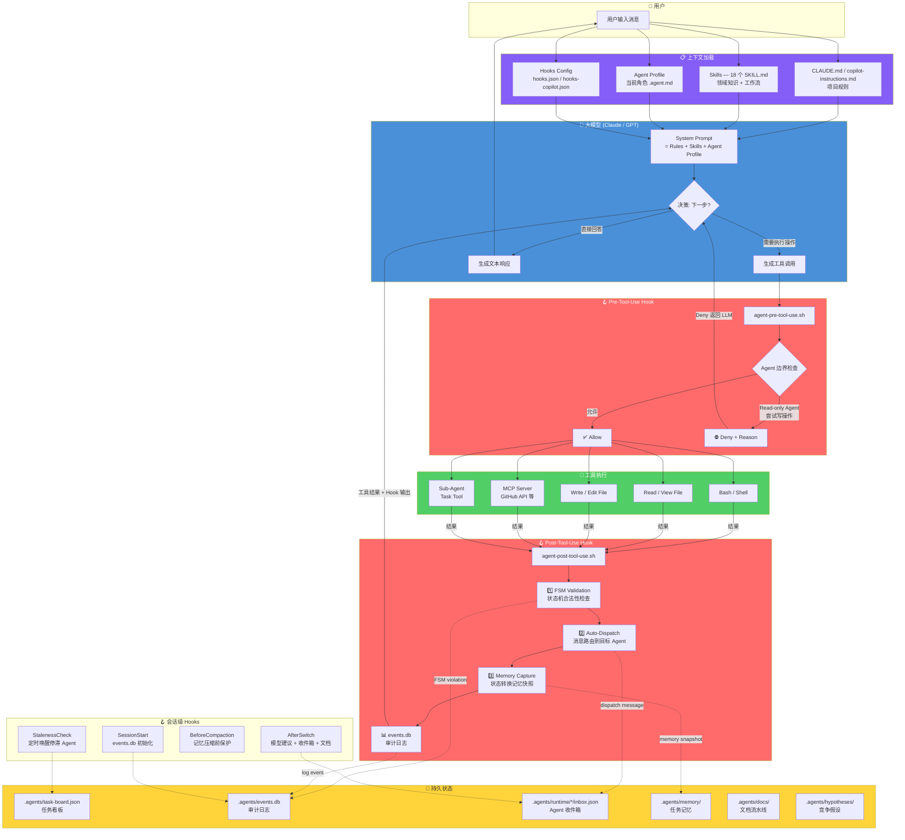
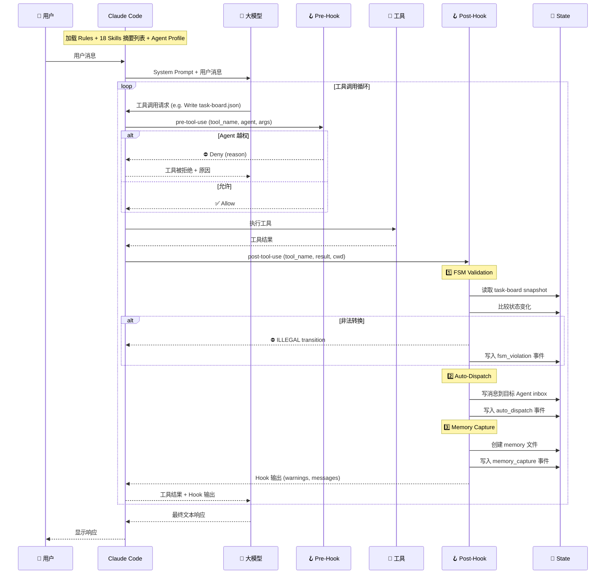
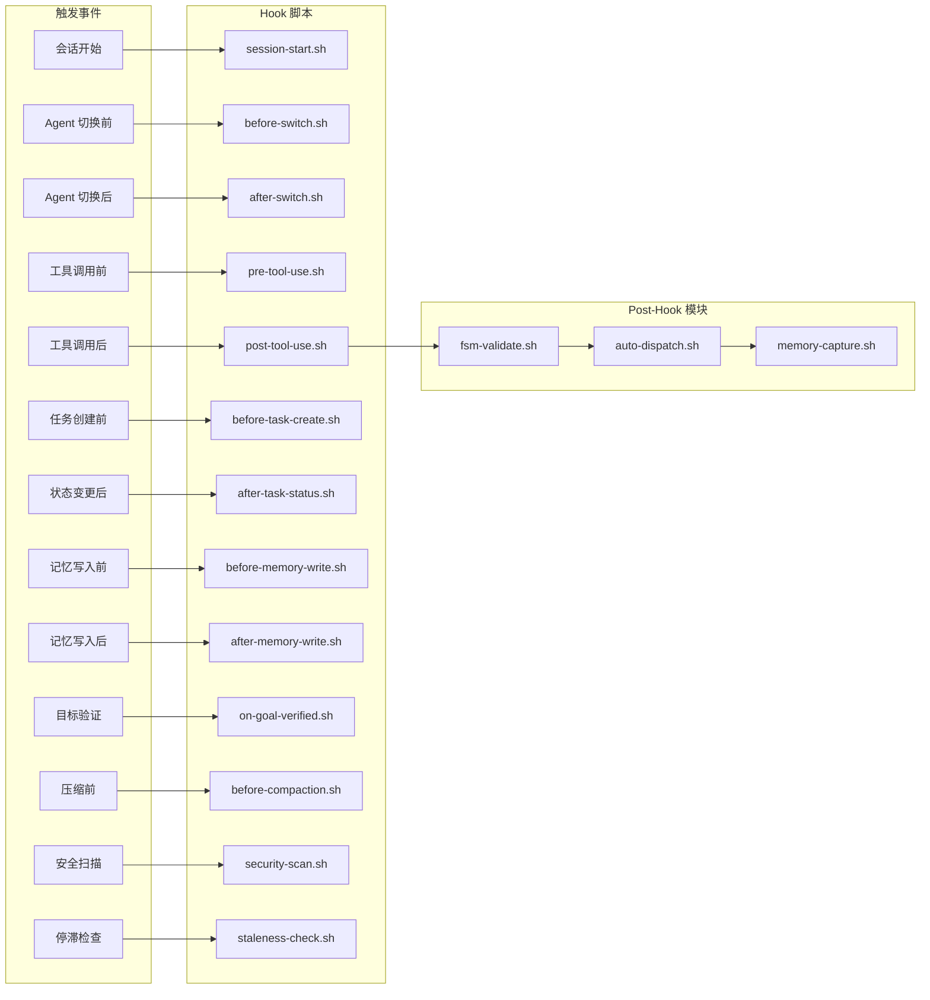
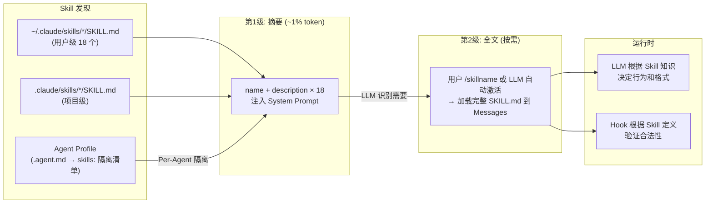

# Claude Code 运行流程图

## 主流程 — 用户消息 → 工具调用 → 响应

```mermaid
flowchart TB
    subgraph User["👤 用户"]
        U1[用户输入消息]
    end

    subgraph Context["📋 上下文加载"]
        C1[CLAUDE.md / copilot-instructions.md<br/>项目规则]
        C2[Skills — 18 个 SKILL.md<br/>领域知识 + 工作流]
        C3[Agent Profile<br/>当前角色 .agent.md]
        C4[Hooks Config<br/>hooks.json / hooks-copilot.json]
    end

    subgraph LLM["🧠 大模型 (Claude / GPT)"]
        L1[System Prompt<br/>= Rules + Skills + Agent Profile]
        L2{决策: 下一步?}
        L3[生成工具调用]
        L4[生成文本响应]
    end

    subgraph Hooks_Pre["🪝 Pre-Tool-Use Hook"]
        HP1[agent-pre-tool-use.sh]
        HP2{Agent 边界检查}
        HP3[✅ Allow]
        HP4[⛔ Deny + Reason]
    end

    subgraph Tools["🔧 工具执行"]
        T1[Bash / Shell]
        T2[Read / View File]
        T3[Write / Edit File]
        T4[MCP Server<br/>GitHub API 等]
        T5[Sub-Agent<br/>Task Tool]
    end

    subgraph Hooks_Post["🪝 Post-Tool-Use Hook"]
        HPO1[agent-post-tool-use.sh]
        HPO2[1️⃣ FSM Validation<br/>状态机合法性检查]
        HPO3[2️⃣ Auto-Dispatch<br/>消息路由到目标 Agent]
        HPO4[3️⃣ Memory Capture<br/>状态转换记忆快照]
        HPO5[📊 events.db<br/>审计日志]
    end

    subgraph Session_Hooks["🪝 会话级 Hooks"]
        SH1[SessionStart<br/>events.db 初始化]
        SH2[AfterSwitch<br/>模型建议 + 收件箱 + 文档]
        SH3[BeforeCompaction<br/>记忆压缩前保护]
        SH4[StalenessCheck<br/>定时唤醒停滞 Agent]
    end

    subgraph State["💾 持久状态"]
        S1[.agents/task-board.json<br/>任务看板]
        S2[.agents/events.db<br/>审计日志]
        S3[.agents/runtime/*/inbox.json<br/>Agent 收件箱]
        S4[.agents/memory/<br/>任务记忆]
        S5[.agents/docs/<br/>文档流水线]
        S6[.agents/hypotheses/<br/>竞争假设]
    end

    %% 主流程
    U1 --> C1 & C2 & C3 & C4
    C1 & C2 & C3 & C4 --> L1
    L1 --> L2
    L2 -->|需要执行操作| L3
    L2 -->|直接回答| L4
    L4 --> U1

    %% 工具调用流程
    L3 --> HP1
    HP1 --> HP2
    HP2 -->|Read-only Agent<br/>尝试写操作| HP4
    HP2 -->|允许| HP3
    HP4 -->|Deny 返回 LLM| L2
    HP3 --> T1 & T2 & T3 & T4 & T5

    %% 工具结果
    T1 & T2 & T3 & T4 & T5 -->|结果| HPO1
    HPO1 --> HPO2
    HPO2 --> HPO3
    HPO3 --> HPO4
    HPO4 --> HPO5

    %% Post-hook 写状态
    HPO2 -.->|FSM violation| S2
    HPO3 -.->|dispatch message| S3
    HPO4 -.->|memory snapshot| S4
    HPO5 -.->|log event| S2

    %% 结果返回 LLM
    HPO5 -->|工具结果 + Hook 输出| L2

    %% 会话级 hooks
    SH1 -.-> S2
    SH2 -.-> S3
    SH4 -.-> S1

    style LLM fill:#4a90d9,color:#fff
    style Hooks_Pre fill:#ff6b6b,color:#fff
    style Hooks_Post fill:#ff6b6b,color:#fff
    style Tools fill:#51cf66,color:#fff
    style State fill:#ffd43b,color:#333
    style Context fill:#845ef7,color:#fff
```

## 详细交互时序图

```mermaid
sequenceDiagram
    participant U as 👤 用户
    participant CC as Claude Code
    participant LLM as 🧠 大模型
    participant PRE as 🪝 Pre-Hook
    participant TOOL as 🔧 工具
    participant POST as 🪝 Post-Hook
    participant DB as 💾 State

    Note over CC: 加载 Rules + 18 Skills 摘要列表 + Agent Profile

    U->>CC: 用户消息
    CC->>LLM: System Prompt + 用户消息

    loop 工具调用循环
        LLM->>CC: 工具调用请求 (e.g. Write task-board.json)

        CC->>PRE: pre-tool-use (tool_name, agent, args)
        alt Agent 越权
            PRE-->>CC: ⛔ Deny (reason)
            CC-->>LLM: 工具被拒绝 + 原因
        else 允许
            PRE-->>CC: ✅ Allow
        end

        CC->>TOOL: 执行工具
        TOOL-->>CC: 工具结果

        CC->>POST: post-tool-use (tool_name, result, cwd)

        Note over POST: 1️⃣ FSM Validation
        POST->>DB: 读取 task-board snapshot
        POST->>DB: 比较状态变化
        alt 非法转换
            POST-->>CC: ⛔ ILLEGAL transition
            POST->>DB: 写入 fsm_violation 事件
        end

        Note over POST: 2️⃣ Auto-Dispatch
        POST->>DB: 写消息到目标 Agent inbox
        POST->>DB: 写入 auto_dispatch 事件

        Note over POST: 3️⃣ Memory Capture
        POST->>DB: 创建 memory 文件
        POST->>DB: 写入 memory_capture 事件

        POST-->>CC: Hook 输出 (warnings, messages)
        CC-->>LLM: 工具结果 + Hook 输出
    end

    LLM-->>CC: 最终文本响应
    CC-->>U: 显示响应
```

## Hook 触发矩阵

```mermaid
graph LR
    subgraph Events["触发事件"]
        E1[会话开始]
        E2[Agent 切换前]
        E3[Agent 切换后]
        E4[工具调用前]
        E5[工具调用后]
        E6[任务创建前]
        E7[状态变更后]
        E8[记忆写入前]
        E9[记忆写入后]
        E10[目标验证]
        E11[压缩前]
        E12[安全扫描]
        E13[停滞检查]
    end

    subgraph Hooks["Hook 脚本"]
        H1[session-start.sh]
        H2[before-switch.sh]
        H3[after-switch.sh]
        H4[pre-tool-use.sh]
        H5[post-tool-use.sh]
        H6[before-task-create.sh]
        H7[after-task-status.sh]
        H8[before-memory-write.sh]
        H9[after-memory-write.sh]
        H10[on-goal-verified.sh]
        H11[before-compaction.sh]
        H12[security-scan.sh]
        H13[staleness-check.sh]
    end

    subgraph Modules["Post-Hook 模块"]
        M1[fsm-validate.sh]
        M2[auto-dispatch.sh]
        M3[memory-capture.sh]
    end

    E1 --> H1
    E2 --> H2
    E3 --> H3
    E4 --> H4
    E5 --> H5
    E6 --> H6
    E7 --> H7
    E8 --> H8
    E9 --> H9
    E10 --> H10
    E11 --> H11
    E12 --> H12
    E13 --> H13

    H5 --> M1 --> M2 --> M3
```

## Skill 加载机制

```mermaid
flowchart LR
    subgraph Load["Skill 发现"]
        direction TB
        L1["~/.claude/skills/*/SKILL.md<br/>(用户级 18 个)"]
        L2[".claude/skills/*/SKILL.md<br/>(项目级)"]
        L3["Agent Profile<br/>(.agent.md → skills: 隔离清单)"]
    end

    subgraph Level1["第1级: 摘要 (~1% token)"]
        I1["name + description × 18<br/>注入 System Prompt"]
    end

    subgraph Level2["第2级: 全文 (按需)"]
        I4["用户 /skillname 或 LLM 自动激活<br/>→ 加载完整 SKILL.md 到 Messages"]
    end

    subgraph Runtime["运行时"]
        R1["LLM 根据 Skill 知识<br/>决定行为和格式"]
        R2["Hook 根据 Skill 定义<br/>验证合法性"]
    end

    L1 & L2 --> I1
    L3 -->|"Per-Agent 隔离"| I1
    I1 -->|"LLM 识别需要"| I4
    I4 --> R1 & R2
```
