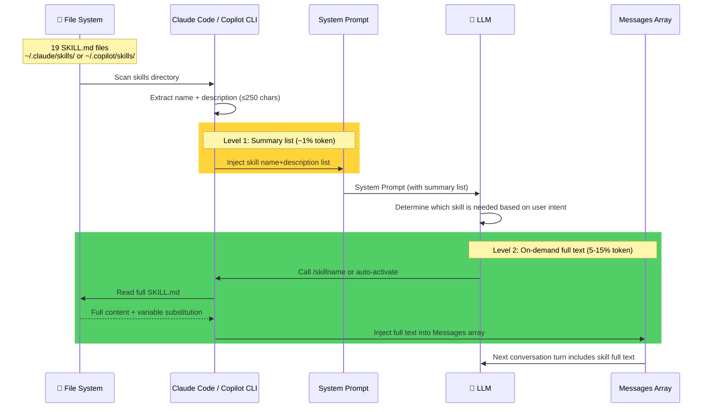
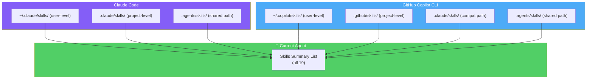
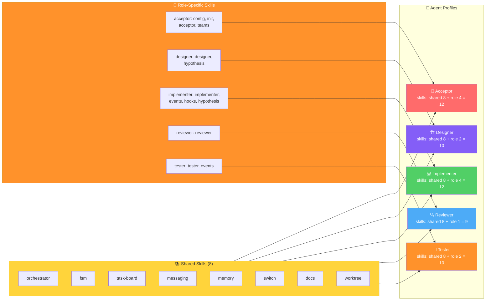
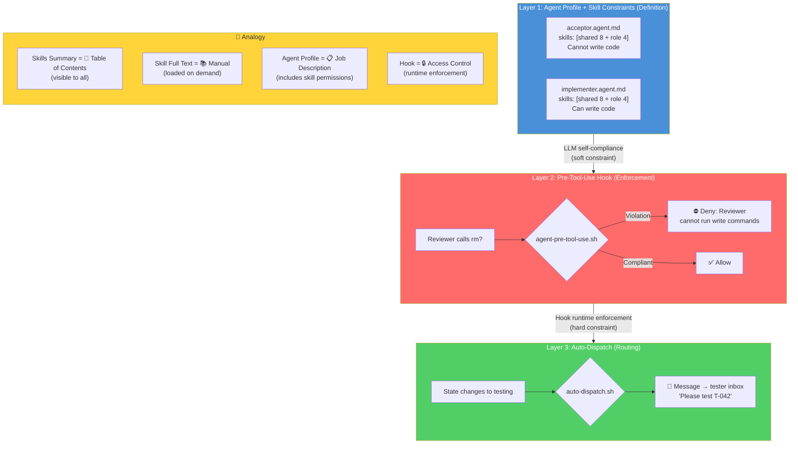
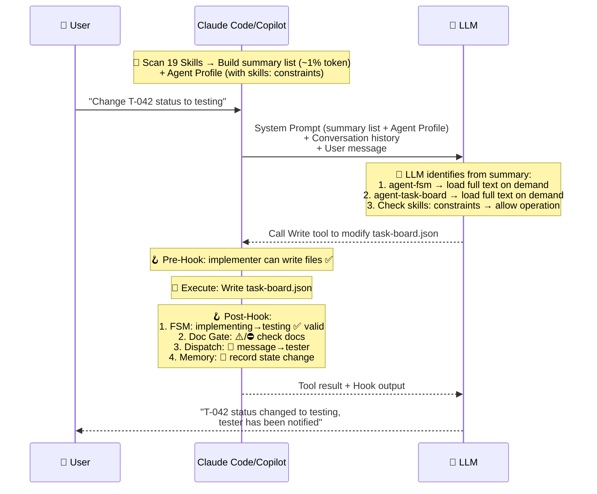

# Skills Mechanism — Loading, Injection & Agent Behavior

## 1. Two-Level Loading

## 2. Skill Discovery Paths

| Dimension | Claude Code | Copilot CLI |
|-----------|------------|-------------|
| User-level | `~/.claude/skills/` | `~/.copilot/skills/` |
| Project-level | `.claude/skills/` | `.github/skills/` |
| Shared path | `.agents/skills/` ✅ | `.agents/skills/` ✅ |
| Hot reload | ⚠️ Memoize cache, requires new session | `/skills reload` |
| Conditional activation | frontmatter `paths:` glob | Not supported (ignored) |

> **`paths:` Conditional Activation**: Adding `paths: ["hooks/**", "**/*.sh"]` to SKILL.md frontmatter limits that skill to auto-load into the summary list only when operating on matching files. Manual `/skillname` invocation is unaffected. Currently only `agent-hooks` uses this feature.

## 3. Per-Agent Skill Isolation

> **Isolation Strength**: Prompt-based soft constraint (~95% LLM compliance). Isolation only applies between the 5 project-level agent roles; it does not affect skill usage in non-agent mode.

## 4. Three-Layer Behavior Control

## 5. Complete Request Lifecycle

