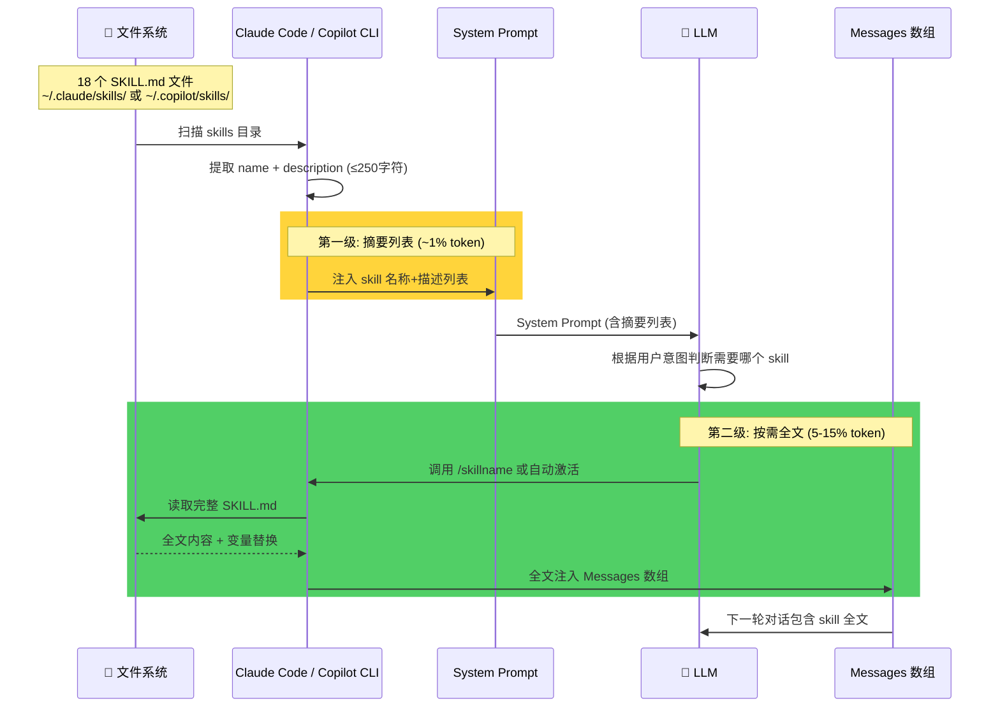
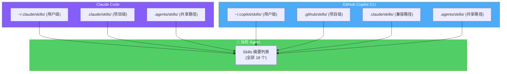
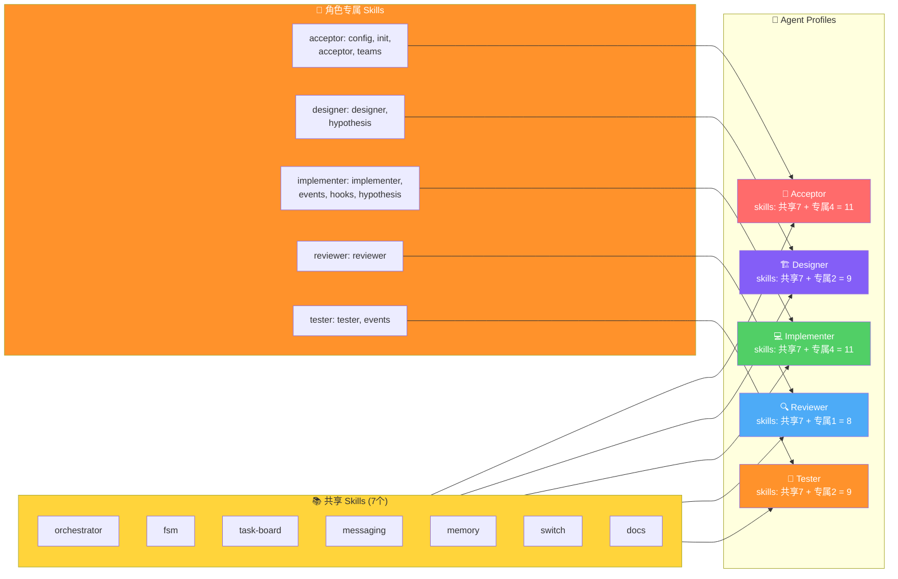
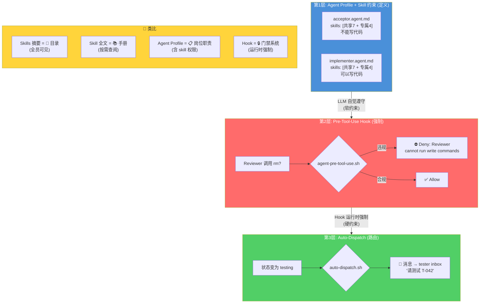
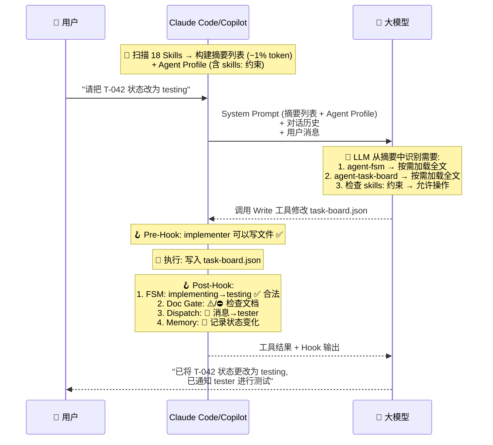

# Skills 工作机制 — 加载、注入与 Agent 行为

## 1. 两级加载机制

## 2. Skill 发现路径

| 维度 | Claude Code | Copilot CLI |
|------|------------|-------------|
| 用户级 | `~/.claude/skills/` | `~/.copilot/skills/` |
| 项目级 | `.claude/skills/` | `.github/skills/` |
| 共享路径 | `.agents/skills/` ✅ | `.agents/skills/` ✅ |
| 热加载 | ⚠️ memoize 缓存, 需新会话 | `/skills reload` |
| 选择性 | frontmatter `paths:` | `/skills` 命令 |

## 3. Per-Agent Skill 隔离

> **隔离强度**: Prompt 软约束 (~95% LLM 遵守率)。隔离仅影响项目级 5 个 agent 角色之间，不影响非 agent 模式下的 skill 使用。

## 4. 三层行为控制体系

## 5. 完整请求生命周期

