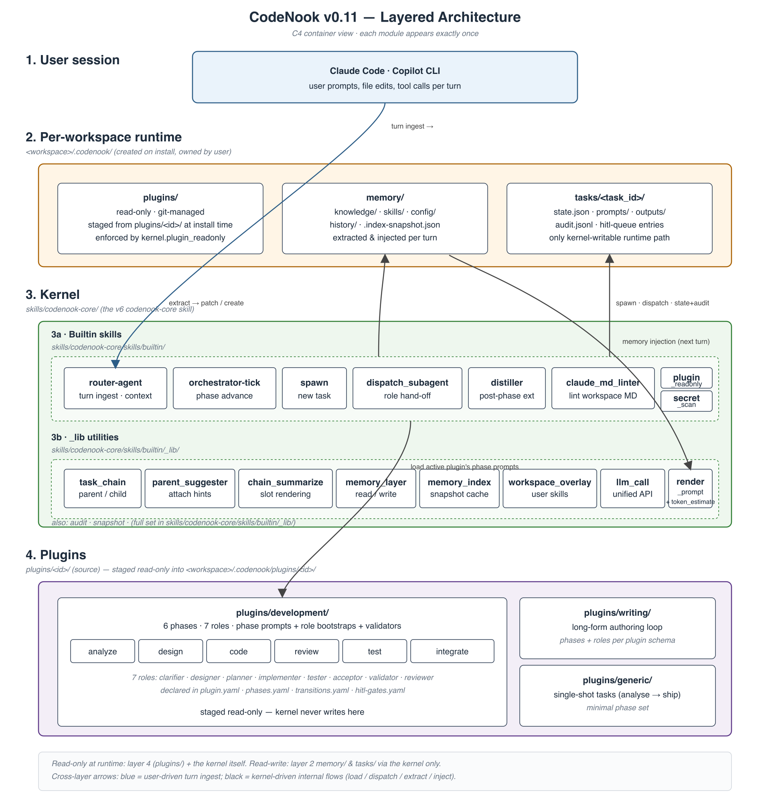

# The Essence of Vibe Coding: Natural Language Is the New Programming Language, but Software Engineering Isn't Going Away

## From Compilers to Agents: The Unchanged Essence

Vibe Coding is essentially natural language programming.

In traditional programming, we use specialized languages — Java, C++, Python — to describe functionality, then compilers translate it into executable code.

Vibe Coding does the same thing: describe functionality in natural language, and an AI Agent translates it into executable code.

**What hasn't changed**: Whether you use natural language or Java, they're just tools for describing "what I need built."

**What has changed**: Because Agents are smart enough, natural language descriptions don't need the precision of traditional languages, and you don't need to learn arcane programming concepts. This dramatically lowers the barrier to programming.

But here's my point — **the essence of software engineering hasn't changed**. If you want to build a quality application, you still need requirements analysis, architecture design, code review, and testing.

## Why This Matters: A Painful Vibe Coding Experience

This conclusion isn't theoretical — it comes from real, painful Vibe Coding experience.

A typical session looks like this:

```
Me: "Implement user login"
Agent: (codes away, done)
Me: (manual testing)...nope, blank page after login
Me: "Blank page after login, fix it"
Agent: (codes away again)
Me: (manual testing)...login works now, but registration is broken
Me: "Why is registration broken?"
Agent: (codes away yet again)
Me: (manual testing)...
...repeat N times...
```

You're stuck at your computer, endlessly chatting with the Agent, typing, manually testing, reworking. Frankly, **it's painful**.

The problem isn't that the Agent isn't smart enough — the process lacks **structure**:
- No one thinks through requirements and design before coding
- No automated tests — everything verified manually
- No code review — bugs keep piling up
- No structured issue tracking — fix one, another appears


Aren't these exactly the problems traditional software engineering already solved?

## My Experiment: Agent-Driven Full SDLC

So I built a project: **CodeNook — a multi-agent development framework**.

Core idea — if Vibe Coding is "natural language programming," then the entire software development lifecycle should be definable and executable in natural language too.

Today's incarnation (v0.11) is a two-layer system: a small **kernel** (`skills/codenook-core/`) that knows about routing, dispatch, memory, and gates — and an installable **plugin** (`plugins/development/`) that defines the actual software-engineering pipeline (clarify → design → plan → implement → test → accept → validate → ship).



## System Architecture

```
                       ┌─────────────────────────────┐
   user turn ────────► │  Main session (Claude /     │
                       │  Copilot CLI)               │
                       └──────────────┬──────────────┘
                                      │
                                      ▼
        ┌───────────────────── codenook-core ────────────────────┐
        │                                                         │
        │   router-agent  ──►  spawn  ──►  orchestrator-tick      │
        │        │                                  │             │
        │        │       ┌──────────────────────────┤             │
        │        ▼       ▼                          ▼             │
        │   memory_index  dispatch_subagent   extractor-batch     │
        │                          │                  │           │
        └──────────────────────────┼──────────────────┼───────────┘
                                   ▼                  ▼
                        ┌───────────────────────────────────────┐
                        │  .codenook/  (per-workspace runtime)  │
                        │   plugins/    memory/    tasks/        │
                        └───────────────────────────────────────┘

       Two layers, one verdict contract, persistent memory,
       deterministic dispatch — all kernel-only behaviour is
       audited under tasks/<T-NNN>/audit/.
```

## A Complete Workflow

Take "add user login" as an example — compare traditional Vibe Coding with the framework approach:

### Traditional Vibe Coding (Painful)

```
You: "Implement login" → Agent codes → you test manually → broken → you type feedback
→ Agent fixes → you test again → still broken → more feedback → ... repeat N times
→ you give up and ship a half-baked product
```

### Using CodeNook (Structured)

```
                    User
                     │
              "Add JWT login to the auth service"
                     │
                     ▼
   router-agent  ──► drafts tasks/T-001/draft-config.yaml
                     │  (plugin: development, parent: independent,
                     │   model tier: tier_strong)
                     ▼
              user confirms
                     │
                     ▼
   orchestrator-tick (one phase per call)
                     │
       ┌─────────────┼─────────────┬─────────────┬───────────────┐
       ▼             ▼             ▼             ▼               ▼
   clarifier    designer       planner      implementer      tester
   (spec)       (ADR)          (TDD plan)   (red→green)      (run + report)
                     │             │             │               │
                     ▼             ▼             ▼               ▼
               extractor-batch after every phase
               → memory/knowledge/<topic>.md
               → memory/skills/<name>/
               → memory/config.yaml entries[]
                     │
                     ▼
              acceptor → validator → reviewer → done ✅
```

**You only do two things per task: confirm the draft and approve at HITL gates.** Everything between — phase dispatch, sub-agent spawning, verdict reading, post-validation, memory extraction — is the kernel's job.

## Benefits

### 1. Memory accumulates, not chat history

Every phase's useful artefacts (decisions, conventions, reusable skills) are extracted by `extractor-batch` into `memory/`. The next task's router-agent reads `memory/knowledge/` as a digest before drafting its config — so a follow-up turn like *"now add refresh-token support"* automatically inherits the original JWT design without you having to re-explain anything.

### 2. Task chains, not flat history

When you say *"add refresh-token support"*, `parent_suggester` sees the recent JWT-login task and suggests it as parent (Jaccard top-3). If you confirm, `chain_summarize` walks the ancestor chain and injects a compressed narrative into the child's prompt — bounded at 8K tokens via two-pass LLM compression.

### 3. The kernel can never lie about what happened

Every dispatch is logged to `tasks/<T-NNN>/audit/`. Every memory write goes through `memory/history/extraction-log.jsonl`. Every plugin file is read-only (`plugin_readonly` enforces it). Every commit on the repo passes `claude_md_linter`, `secret_scan`, and 851/851 bats. *"Process-driven"* isn't a slogan — it's a set of fcntl locks and atomic writes.

### 4. Plugins are the unit of extension

The kernel knows nothing about software engineering. `plugins/development/` defines the 8 phases, the role profiles, the verdict contract, and the post-validators. Adding a `plugins/writing/` or `plugins/research/` doesn't need a single kernel change — install it through the same 12-gate pipeline and it shows up as a `PLUGINS_INDEX` entry on the next router-agent turn.

### 5. Resumable at any point

All state lives in files (JSON + YAML + Markdown), not in AI memory. Even if the CLI crashes, the machine restarts, or you switch sessions, `session-resume` reads `tasks/<tid>/state.json` and the next `orchestrator-tick` picks up exactly where the previous one stopped.

## How to Use

### Install (30 seconds)

```bash
curl -sL https://raw.githubusercontent.com/cintia09/CodeNook/main/install.sh | bash
```

The installer detects Claude Code and/or Copilot CLI and copies the `codenook-core` kernel into the appropriate skills directory.

### Seed a workspace

```bash
cd ~/code/my-project
~/.claude/skills/codenook-core/init.sh
~/.claude/skills/codenook-core/init.sh --refresh-models
~/.claude/skills/codenook-core/init.sh \
    --install-plugin ~/.claude/skills/codenook-core/dist/development-*.tar.gz
```

### Start a turn

In your AI session, just talk:

> "I want to add JWT login to the auth service."

The router-agent spawns, drafts a config, suggests a parent task if one looks relevant, and asks you to confirm. From there, every `orchestrator-tick` advances one phase. You only intervene at HITL gates (`design_signoff`, `pre_test_review`, `acceptance` for the development plugin).

## Conclusion

Vibe Coding has lowered the barrier to programming to unprecedented levels. But **writing code is just one part of software engineering**.

Those "seemingly tedious" steps in traditional software engineering — requirements analysis, design review, code review, testing — exist not to torment developers, but because **good software simply requires them**.

AI hasn't changed this fact, but AI can change *who* does these things.

Before: humans design, humans code, humans test. Now: agents design, agents code, agents test — but the *process* is enforced by a kernel that can't be talked out of running gates, and the *memory* is enforced by a layer that can't be talked out of writing audit lines. Humans only need to define "what to build" and approve at the gates that matter.

This may be the ultimate form of Vibe Coding — not one person endlessly going back and forth with one Agent, but an **agent team** with a deterministic kernel, a swappable plugin layer, and a memory layer that actually remembers — collaborating like a real software development team.

The framework realising these ideas today is CodeNook v0.11. The kernel is `skills/codenook-core/`. The pipeline is `plugins/development/`. The runtime is `.codenook/`. The design archive — 9 design docs, 117 acceptance tests, 100 PASS / 13 PARTIAL / 4 SKIP — is under [`docs/`](../docs/README.md).

And the interesting part? This framework itself was built by agents.

---

> 🔗 Project: [github.com/cintia09/CodeNook](https://github.com/cintia09/CodeNook) · v0.11.1 stable · 851 bats green · M1–M11 shipped
